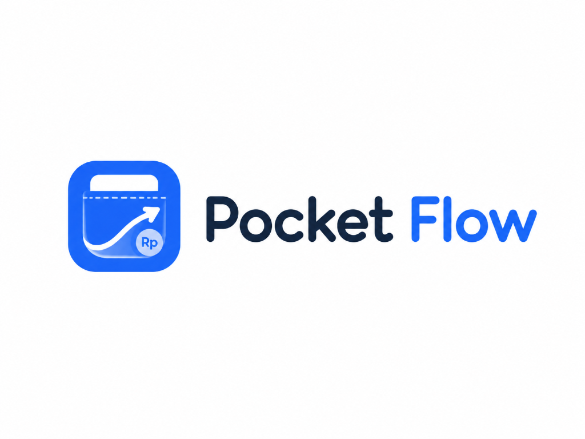

<div align="center">
  

  # PocketFlow
  ### *Smart Salary-First Zero-Based Budgeting App*

  [](https://flutter.dev)
  [](https://riverpod.dev)
  [](#-desain-antarmuka)
  [](#)

  **PocketFlow** adalah aplikasi manajemen finansial personal modern yang dirancang dengan metodologi **Salary-First Zero-Based Budgeting**. Aplikasi ini membantu Anda mengalokasikan setiap rupiah gaji secara terencana sejak hari pertama gajian masuk, mencegah kebiasaan boncos dengan metrik **Safe Spending Hari Ini**, serta memonitor target tabungan dan cicilan dalam satu ekosistem antarmuka neo-banking yang elegan.
</div>

---

## 🌟 Mengapa PocketFlow?

Sebagian besar aplikasi pencatat keuangan konvensional hanya bersifat *reaktif* (mencatat uang yang sudah terlanjur keluar). 

**PocketFlow hadir dengan pendekatan proaktif:**
1. **Alokasikan Gaji di Awal**: Begitu gaji masuk, sistem langsung membagi penghasilan ke pos wajib, tabungan, dan kebutuhan harian sesuai aturan alokasi otomatis yang Anda tentukan.
2. **Kendalikan Pengeluaran Harian**: Metrik cerdas **Safe Spending Hari Ini** membagi sisa budget belanja dengan sisa hari bulan berjalan, memberi Anda batas aman jajan harian yang realistis.
3. **Setiap Rupiah Punya Peran**: Mengusung konsep *Zero-Based Budgeting*, semua penghasilan teralokasi hingga Rp0 tanpa sisa liar yang tidak terencana.

---

## ✨ Fitur-Fitur Utama

### 1. 💳 Dashboard Finansial & Safe Spending Tracker
- **Royal Blue Hero Card**: Tampilan ringkasan saldo aman hari ini dengan fitur intip/sembunyikan saldo (*privacy mode*).
- **Safe Spending Hari Ini**: Menghitung otomatis berapa nominal yang aman Anda belanjakan hari ini agar budget bertahan hingga akhir bulan.
- **Aksi Cepat 1-Ketuk**: Tombol sirkular cepat untuk *Catat Keluar, Catat Masuk, Alokasi Gaji,* dan *Laporan Keuangan*.
- **Ringkasan Budget Kategori**: Bar progres visual yang memberi peringatan dini sebelum pos pengeluaran Anda *Over Budget*.

### 2. 🏦 Alokasi Gaji Otomatis (Zero-Based Engine)
- **Simulasi Alokasi Instan**: Masukkan nominal gaji bersih (*Take Home Pay*), dan sistem akan menghitung alokasi nominal tetap (*Fixed*) maupun persentase (*Percentage*) sesuai prioritas.
- **Deteksi Defisit & Peringatan Dini**: Memberikan notifikasi jika penghasilan tidak mencukupi untuk memenuhi pos-pos alokasi wajib.
- **Riwayat Penggajian**: Arsip lengkap alokasi gaji bulanan untuk perbandingan antar periode.

### 3. 🧾 Pencatatan Transaksi & Validasi Finansial Pintar
- **Filter Fleksibel**: Telusuri transaksi berdasarkan kategori *Semua, Pengeluaran,* atau *Pemasukan*.
- **Validasi Protektif Pemasukan**: Memberikan panduan ramah jika Anda mencatat pengeluaran di periode yang belum memiliki catatan pemasukan.
- **Metode Pembayaran**: Dukungan metode pembayaran tunai, transfer bank, QRIS, e-wallet, dan kartu debit.

### 4. 🎯 Target Tabungan & Dana Darurat
- **Visual Progress Tracker**: Kartu target bergaya modern dengan progress bar ketercapaian dan estimasi sisa dana.
- **Dana Darurat Multi-Bulan**: Pos terdedikasi untuk mengamankan 3 hingga 6 bulan biaya hidup.
- **Setor & Tarik Interaktif**: Catat mutasi tabungan secara langsung dan pantau persentase keberhasilan impian finansial Anda.

### 5. 💸 Manajemen Utang & Cicilan
- **Pelacak Sisa Pinjaman**: Pantau progress pembayaran cicilan, kartu kredit, dan *Paylater*.
- **Pencatatan Cicilan**: Form pelunasan cicilan berkala untuk memastikan keuangan tetap terkendali dan bebas denda keterlambatan.

### 6. 📊 Laporan Keuangan & Visual Donut Analytics
- **Donut Ring Chart**: Diagram cincin visual interaktif untuk rincian pengeluaran tiap kategori.
- **Arus Kas Bersih (Net Cash Flow)**: Menampilkan selisih pemasukan terhadap pengeluaran aktual.
- **Savings Rate**: Persentase rasio tabungan terhadap total pendapatan bulanan.

### 7. 🏷️ Manajemen Kategori & Template Aturan Alokasi
- **Template Bawaan Siap Pakai**: Pilihan struktur kategori untuk *Karyawan / Basic Employee, Mahasiswa / Student, Freelancer,* dan *Keluarga / Family*.
- **Aturan Alokasi Kustom**: Buat aturan alokasi tetap maupun persentase dari sisa penghasilan sesuai gaya hidup Anda.

---

## 🎨 Desain Antarmuka (Modern Neo-Banking UX)

PocketFlow dirancang dengan estetika **Clean Light Neo-Banking**:
- **Palet Warna Segar**: Kanvas terang bersih (`#F4F6FA`), permukaan kartu putih murni (`#FFFFFF`), aksen *Royal Blue Gradient*, dan *Pastel Badges*.
- **Floating Action Center Button (`+`)**: Tombol navigasi melayang di tengah bawah untuk aksi pencatatan cepat dari layar manapun.
- **Tipografi Modern**: Memanfaatkan perpaduan font Google **Plus Jakarta Sans** (headline & angka) dan **DM Sans** (body text).
- **Responsif Penuh**: Mendukung layar Mobile (Android & iOS), Tablet, hingga Desktop browser tanpa hambatan overflow.

---

## 🚀 Memulai Proyek

### Prasyarat
- [Flutter SDK](https://flutter.dev/docs/get-started/install) (versi 3.22 atau lebih baru)
- Dart SDK (versi 3.4 atau lebih baru)
- Browser Chrome (untuk menjalankan versi Web) atau Android Studio / Xcode (untuk menjalankan versi Mobile)

### Instalasi & Menjalankan Aplikasi

1. **Clone repositori**:
   ```bash
   git clone https://github.com/Zee7X/Pocket-Flow.git
   cd pocket_flow
   ```

2. **Pasang dependensi**:
   ```bash
   flutter pub get
   ```

3. **Konfigurasi Lingkungan (Environment Variables)**:
   Salin berkas template konfigurasi `.env.example` menjadi `.env`:
   ```bash
   cp .env.example .env
   ```
   Buka berkas `.env` dan masukkan kredensial project Supabase Anda:
   ```env
   SUPABASE_URL=https://your-project-ref.supabase.co
   SUPABASE_ANON_KEY=your-supabase-anon-key-here
   ```

4. **Jalankan aplikasi (Mode Web)**:
   ```bash
   flutter run -d chrome --dart-define-from-file=.env
   ```
   *atau jalankan pada web server lokal:*
   ```bash
   flutter run -d web-server --web-port=52624 --dart-define-from-file=.env
   ```

5. **Build APK Android (Mode Rilis)**:
   Untuk mengompilasi file APK yang siap dipasang di HP Android:
   ```bash
   flutter build apk --release --dart-define-from-file=.env
   ```
   *Hasil file APK akan berada di folder `build/app/outputs/flutter-apk/app-release.apk`.*

6. **Menjalankan Pengujian Otomatis (Automated Tests)**:
   ```bash
   flutter test
   ```

---

## 📱 Struktur Direktori Utama

```
lib/
├── app/                  # Inisialisasi tema (theme.dart) dan rute navigasi (router.dart)
├── core/                 # Komponen umum, ekstensi mata uang (Rupiah), dan reusable cards
└── features/
    ├── auth/             # Autentikasi akun & profil pengguna
    ├── dashboard/        # Dashboard, Safe Spending, & ringkasan metrik
    ├── salary_allocation/# Logika alokasi gaji otomatis & history
    ├── transactions/     # Pencatatan transaksi pemasukan/pengeluaran
    ├── debts_savings/    # Target tabungan, dana darurat, & pelacak utang
    ├── categories_rules/ # Aturan alokasi, kategori, & template finansial
    └── reports/          # Laporan keuangan, donut analytics, & arus kas
```

---

<div align="center">
  <p>Dibuat dengan ❤️ untuk membantu semua orang mengelola keuangan secara lebih cerdas, tenang, dan terencana.</p>
  <p><b>PocketFlow &copy; 2026</b></p>
</div>
